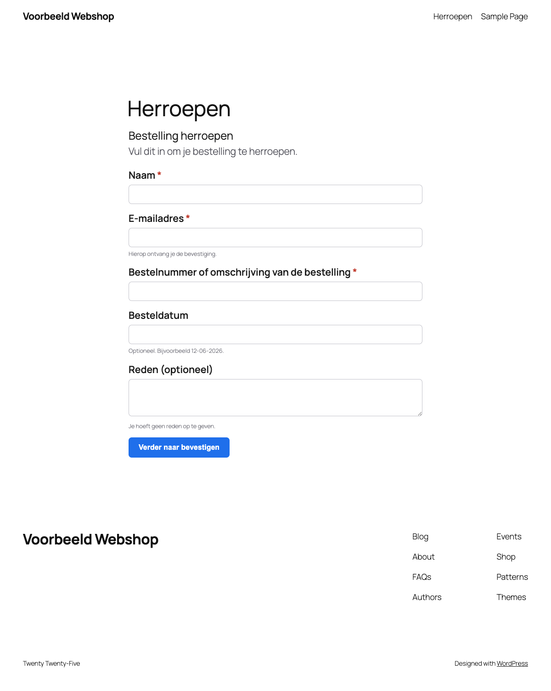
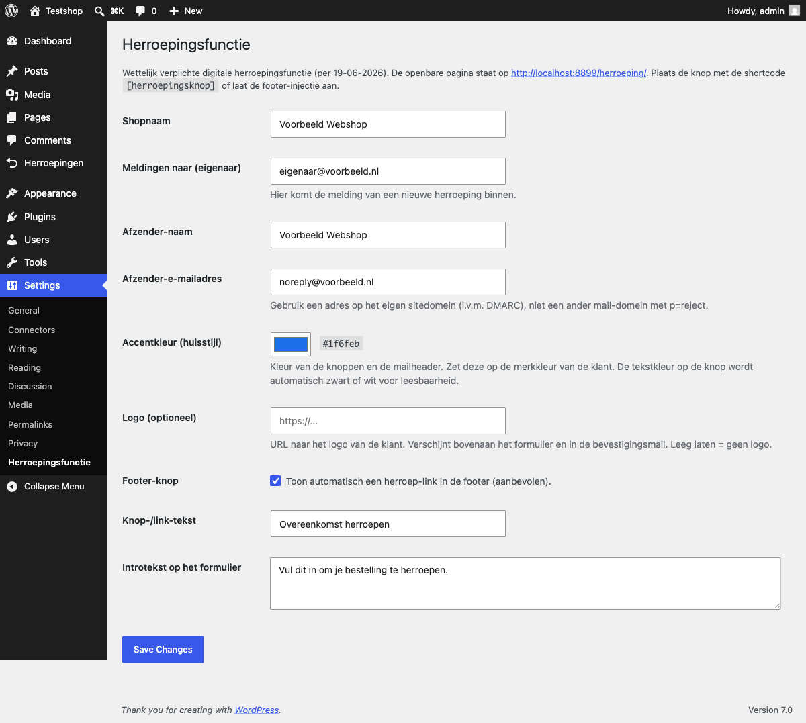

# Herroepingsknop voor WooCommerce

Wettelijk verplichte digitale herroepingsfunctie voor je WordPress-webshop. Gratis. Gemaakt en onderhouden door [072DESIGN](https://072design.nl).

Sinds 19 juni 2026 (EU-Richtlijn 2023/2673) moet een klant zijn online bestelling net zo makkelijk kunnen herroepen als plaatsen. Deze plugin regelt dat: een herroepingsknop, een formulier, een aparte bevestigingsstap en een automatische ontvangstbevestiging per e-mail met vastgelegd tijdstip.

## Wat het doet

- Herroepingsformulier op een eigen pagina via de shortcode `[herroepingsformulier]`, of via de losse route `/herroeping/`.
- Twee-staps-flow: invullen, controleren en bevestigen, klaar.
- Automatische bevestiging naar de klant en een melding naar de webshop, met vastgelegd tijdstip (wettelijke eis).
- Elke herroeping vastgelegd in je beheer, onder "Herroepingen".
- Aanpasbaar aan je huisstijl: accentkleur en optioneel logo. De knop-tekstkleur kiest zichzelf voor leesbaarheid.
- Knop plaatsbaar via de shortcode `[herroepingsknop]` of een automatische footer-link.
- Werkt met en zonder WooCommerce. Met WooCommerce koppelt hij de bestelling als bestelnummer en e-mail matchen.
- Beveiliging via nonce en honeypot. Geen externe diensten, geen tracking, geen licentiekosten.

## Schermafbeeldingen

Het herroepingsformulier op je site:

De instellingen in je WordPress-beheer:

## Installatie

1. Download de laatste versie en upload de map naar `wp-content/plugins/`.
2. Activeer de plugin in je WordPress-beheer.
3. Ga naar **Instellingen → Herroepingsfunctie** en vul shopnaam, e-mailadres, accentkleur en eventueel een logo in.
4. Maak een pagina (bijvoorbeeld "Herroepen") met de shortcode `[herroepingsformulier]` en kies die pagina in de instellingen.
5. Link er in je footermenu naartoe, zodat de knop gedurende de hele bedenktermijn zichtbaar is.

## Liever laten regelen?

Geen zin in gedoe? Wij installeren en configureren de plugin voor je, in je eigen huisstijl, binnen een uur. Mail naar info@072design.nl of kijk op [072design.nl](https://072design.nl).

## Belangrijk

Deze plugin wordt aangeboden as-is, zonder support of garantie. Hij dekt de technische kern van de herroepingsplicht. Voor juridische zekerheid blijf je zelf verantwoordelijk; controleer de actuele wettekst.

## Licentie

[GPL-2.0-or-later](LICENSE). Gemaakt door [072DESIGN](https://072design.nl), Sint Pancras.
